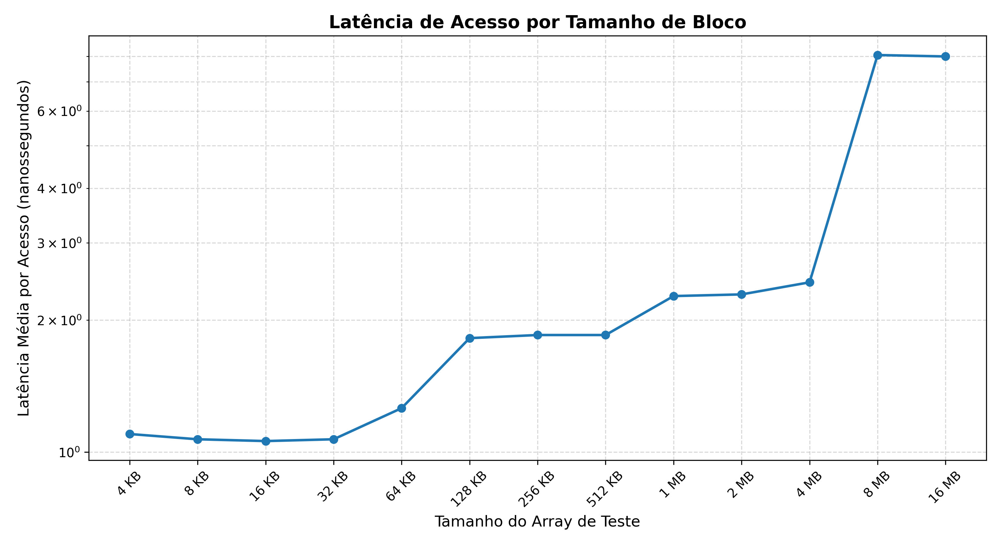
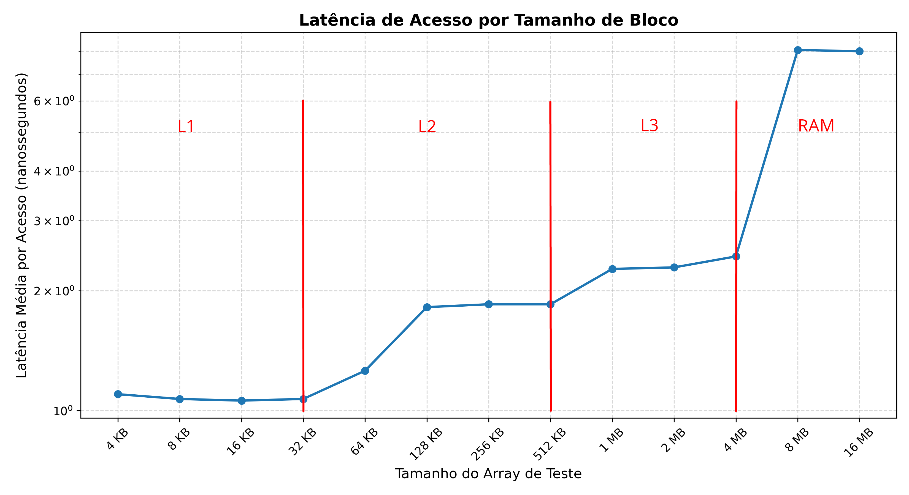

# CI1212-arquitetura-de-computadores-final-assignment

Os objetivos deste trabalho são aumentar a familiaridade com processadores e
recursos geniais que eles têm.

Requer o entendimento de como funciona cache.

Leia o artigo simples mas interessante sobre análise de cache
emhttps://developers.redhat.com/blog/2014/03/10/determining-whether-an-application-has-poor-cache-performance-2

Pesquise uma forma de realizar testes para determinar o tamanho de uma linha da
cache; depois, o tamanho da L1, L2 e L3 de dados.

Implemente e compare, em C/C++/GO, multiplicação de matriz e multiplicação de
matrizes por bloco. Pesquise sobre o assunto e desenvolva exemplo interessante.

Metas a serem atingidas: 0. Ler com atenção o artigo

1. Definir conjunto de testes a serem realizados, escolham algo que vocês
   consigam fazer; podem ir aumentando a ambição à medida que conseguem
   resultados. de histórico em cada um.
2. Implementar e executar os testes para sua máquina
3. Apresentar resultados de forma similar a um artigo simples. Não precisam
   abordar todos aspectos e opções como no artigo de referência. O importante é
   aprender sobre o tema.

Os grupos podem ter de 3 a 4 componentes, vocês se organizam na plataforma de
comunicação para definir os grupos; professor precisa ser avisado na PC sobre a
composição do grupo para ser configurado no UFPR virtual

Deem uma olhada, analisem e proponham algo no tema como TF. Tendo aprovação do
professor, podem seguir adiante. Serão avaliados a iniciativa, empenho, ideias
exploradas e testadas, não necessariamente os resultados obtidos.

A apresentação é fundamental para a nota. Domínio do que foi feito é exigido
para todo grupo.

Entregas: relatório e git com programas de teste e resultados

## Primeiros Testes: Análise de Caches e Validação de Hardware

### Objetivo

O objetivo é determinar empiricamente os tamanhos das memórias cache primárias e
secundárias do processador por meio de testes de latência e, em seguida, validar
os resultados obtidos comparando-os com as especificações físicas reais do
hardware.

### Especificações do Ambiente de Teste

Os experimentos foram executados e validados em uma máquina com a seguinte
configuração de hardware, confirmada através do utilitário `lscpu` do sistema
operacional Arch Linux:

| Componente                | Especificação                                      |
| ------------------------- | -------------------------------------------------- |
| **Processador**           | AMD Ryzen 7 5700U                                  |
| **Núcleos/Threads**       | 8 núcleos físicos (16 threads)                     |
| **Cache L1 de Dados**     | 32 KiB por núcleo (Total: 256 KiB em 8 instâncias) |
| **Cache L1 de Instrução** | 32 KiB por núcleo (Total: 256 KiB em 8 instâncias) |
| **Cache L2**              | 512 KiB por núcleo (Total: 4 MiB em 8 instâncias)  |
| **Cache L3**              | 4 MiB por partição (Total: 8 MiB em 2 instâncias)  |

### Metodologia de Teste

Desenvolvemos um programa em C que aloca arrays de tamanhos crescentes (variando
em potências de base 2, de 4 KB até 16 MB). A medição de tempo foi realizada com
a função `clock_gettime` operando no modo `CLOCK_MONOTONIC`.

Para anular a ação preditiva do processador (_hardware prefetcher_ [1]), o
código realiza saltos de memória (_strides_) de 64 bytes, tamanho equivalente a
uma linha de cache convencional.

A abordagem de execução foi calibrada empírica e iterativamente. Constamos que a
execução de uma única varredura completa por todos os tamanhos de array produziu
dados mais limpos do que a execução de múltiplas repetições sucessivas do mesmo
tamanho em uma única execução do programa. Acreditamos que o supertreinamento
dos preditores internos do chip [2], estavam atrapalhando os resultados quando
os testes eram realizados centenas de vezes por um loop _for_ por execução do
programa. Executar o mesmo programa múltiplas vezes gera resultados parecidos,
confirmando que o resultado não é uma coincidência.

### Resultados e Validação Arquitetural

Os dados extraídos dos testes de latência formaram degraus gráficos que
correspondem exatamente à topologia de memória reportada pelo sistema.

- Fronteira da Cache L1d (32 KB): O patamar mais baixo e rápido de latência foi
  sustentado de 4 KB até a marca de 32 KB. Imediatamente após este valor,
  registrou-se o primeiro salto de tempo.
- Fronteira da Cache L2 (512 KB): Um segundo patamar de latência constante
  estabilizou-se nos blocos subsequentes. Ao ultrapassar o array de 512 KB,
  ocorreu uma nova quebra perceptível de desempenho.
- Comportamento da L3 e Transbordo: As latências registradas a partir de 1 MB
  até 4 MB ficaram constantes. Acima de 4 MB, o tempo de acesso apresenta o
  salto final e mais abrupto da amostragem, indicando o início da busca direta
  na memória RAM.

Concluímos que a metodologia de teste alcançou sucesso em mapear o hardware.

[1]: https://en.wikipedia.org/wiki/Cache_prefetching
[2]: https://en.wikipedia.org/wiki/Branch_predictor

